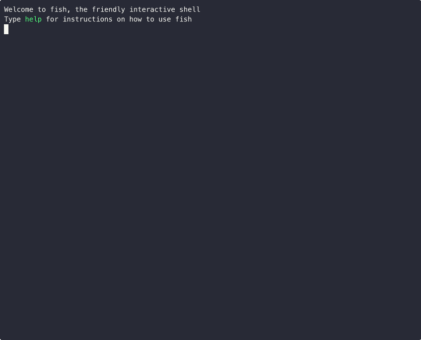
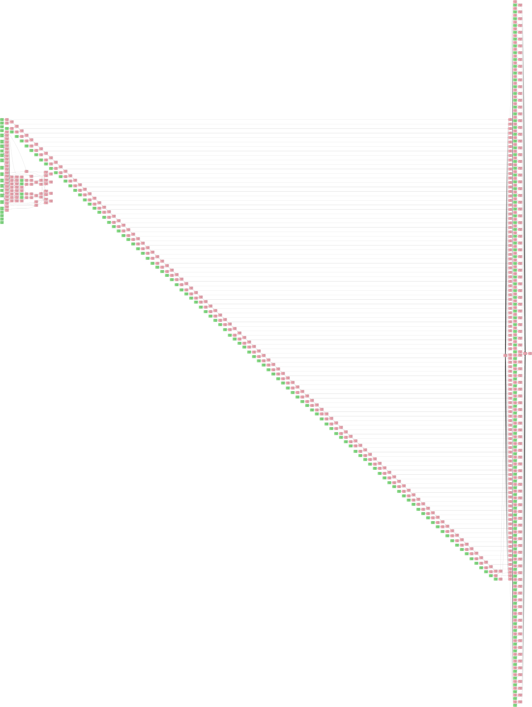

# gpt.c

Implementing decoder-only GPT style transformer in C 

Note: *unfinished dev*

the computational graph can be plotted as well using graphviz (since it's all in slots array)

### How to Run

dataset is within the repo itself

`gcc gpt.c; ./a.out`

### Development

- Currently it's very slow, need update the codebase with CUDA; the last training run is present in assets/train.log
- loss graph visualisation: [loss](https://x.com/attentionmech/status/1884564917304357127)

#### Tasks:

- [X] Implement matrix operations
- [X] Build a basic feed-forward neural network  
- [X] Develop backpropagation 
- [X] Gradient descent
- [X] Implement ReLU and Softmax
- [X] Loss function MSE
- [X] XOR Test
- [X] Add memory management ~~(object tracking, cleanup)~~ (slot system, objects occupy limited slots)
- [X] Construct forward and backward pass logic
- [X] MNIST Test
- [X] Implement Batching (major speedups)
- [X] Implemented GELU, Leaky RELU (all done as part of testing)
- [X] Implement iterative stack based backward pass (didn't do much benefit/ so removed)
- [X] Test the MLP with character prediction (Issues encounters: network stabiliy)
- [X] Tinystories Test
- [X] Implement n dimensional tensors
- [X] Implement Self-Attention Mechanism
- [X] Build a tokenization system (BPE)
- [X] Stack Transformer blocks (works by repetition of layers)
- [X] Multi-Head Attention
- [X] positional Encoding  
- [X] learnable embeddings (one-hot X matrix = embedding)
- [X] adam optim
- [X] add dropout
- [ ] LEARN CUDA
- [ ] add back seq_len param to attention and ffn
- [ ] add masking in attention
- [ ] residual
- [ ] layernorms
- [ ] handle resume/restart of training
- [ ] allow inference from saved file

#### issues encountered:

- the build model function is messy, can simply with a matrix abstraction; otherwise rest of the features would be hard to implement correctly; good point to learn cuda and implement matmuls 
- ~~dropout at 0 is not behaving correctly, which means there is something wrong in impl of it~~
- ~~too much object reallocation, design needs to change~~
- ~~Gradients are not converging properly~~
- ~~MNIST Test failed because of memory leaks.~~
- ~~Slow network convergence for large MLP~~
- ~~Network facing vanishing gradient issue~~
- ~~vanishing gradients after adding attention;~~

